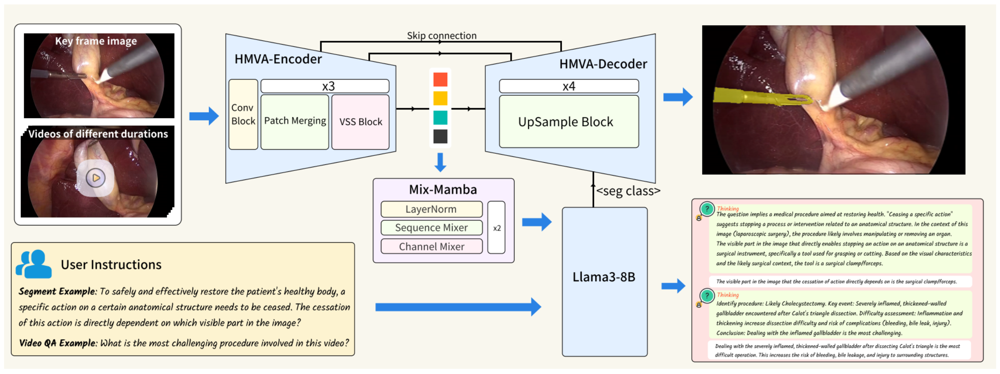

# CholecMamba: A Mamba-based Multimodal Reasoning Model for Cholecystectomy Surgery

---

Automatic analysis of cholecystectomy surgical videos has significant clinical value. However, current models are limited to simple tasks like single-frame phase recognition and multi-tool classification, failing to effectively utilize video context for complex clinical reasoning. They lack the ability to integrate medical textual knowledge with cholecystectomy images and long surgical videos. We propose CholecMamba, a model that compresses video feature sequences through the Mamba architecture and deeply integrates with large-scale reasoning language models to achieve multimodal reasoning capabilities for surgical videos. Our main contributions include:

1. Designing a novel architecture that enables visual feature compression and knowledge feature injection, supporting multi-task video analysis of varying lengths.
2. Innovatively incorporating segmentation category information generated by large language models into the decoder, enhancing surgical video understanding and reasoning segmentation capabilities through medical knowledge logical reasoning.
3. Proposing the Surgical Reasoning Synthesis method, which leverages physician annotations and reinforcement learning with large language models to create the CholecReason dataset containing 49K multi-round dialogues, establishing a new benchmark for surgical video understanding and reasoning segmentation.

Our model achieves optimal performance on existing datasets and CholecReason, with a closed-test score of 0.822, significantly outperforming the best competing model’s score of 0.728.

### Data construction pipeline

### CholecMamba architecture


## Note

This is not the full version of the repository. Some code is currently being refined and will be released once it has been validated and reconstructed to ensure usability.

## Installation

To install the necessary dependencies, run:
```bash
pip install -r requirements.txt
```

## Usage

Detailed instructions for each stage can be found within their respective folders. To test the complete model, navigate to the `test` directory and follow the instructions in the README file provided there.

## Contributing

We welcome contributions from the community. Please fork the repository and submit a pull request with your changes. Ensure your code adheres to our style guidelines and includes appropriate tests.

## License

This project is licensed under the Apache License. See the LICENSE file for more details.

## Contact

For any questions or inquiries, please contact us at 
